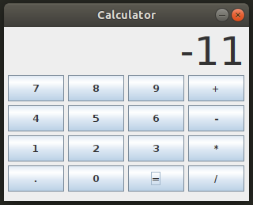

# Java Calculator
Simple calculator built using Java.

    

# About this Project

This project's goal is to create a simple calculator app on which the user can perform simple mathematical operations and get the result displayed.

# Getting Started

**Prerequisites**

To run this project, you'll need to have a basic environment to run a Java App.

**Installing**

Cloning the Repository

    $ git clone https://github.com/awcasella/Calculator-Java.git

    $ cd Calculator-Java
  
Installation of and Java

- ORACLE Java installation tutorial can be found [here](https://www.edivaldobrito.com.br/oracle-java-no-ubuntu-18-04-lts/).

**Run project**

After that, go to src directory and compile the main class

    $ cd src/
    
    $ javac Calculator.java
    
    $ java Calculator

Change to the upper directory and create a manifest.MF document:

    $ cd ..
    
    $ touch manifest.MF

Open the document, and write this:

    Main-Class: src.Calculator
    Name: src/Calculator.class
    Java-Bean: True

To make an executable like, type this:

    $ jar cfm app.jar manifest.MF src

Run the .jar file:

    $ java -jar app.jar

To make it executable on linux, type this:
    
    $ chmod +x app.jar

# Built With

- [NetBeans](https://netbeans.org): Fits the pieces together.

# References

- Interfaces gráficas com Swing. Caelum. Available at: [https://www.caelum.com.br/apostila-java-testes-xml-design-patterns/interfaces-graficas-com-swing/](https://www.caelum.com.br/apostila-java-testes-xml-design-patterns/interfaces-graficas-com-swing/). Access on January, 2020.
 
- Java Swing: Conheça os componentes JTextField e JFormattedTextField. DevMedia. Available at: [https://www.devmedia.com.br/java-swing-conheca-os-componentes-jtextfield-e-jformattedtextfield/30981](https://www.devmedia.com.br/java-swing-conheca-os-componentes-jtextfield-e-jformattedtextfield/30981). Access on January, 2020.
